example00: unpolarized TMDs
---------------------------

In this example we will extract TMD PDFs and FFs using HERMES SIDIS unpolarized multiplicities.

Input file
==========
Lets examine the input.py provided at ::

  extraction/examples00/input.py

At the top we have

.. code-block:: python

  conf={}

This dictionary serves as a common block in the sense of fortran programming with
the difference that we will be able to add not just numbers but also class objects

We next specify the number of CPU (logical-cores) to be used

.. code-block:: python

  conf['ncpu']=2

The next part is only relevant for MC runs (we will use this later)

.. code-block:: python

  conf['nruns']=1
  conf['factor']=4.0
  conf['kappa']=1.5
  conf['tol']=1e-10
  conf['itmax']=int(1e7)
  conf['block size']=10
  conf['nll shift']=0

We proceed to specify the parameters to be fitted

.. code-block:: python

  conf['params']={}

  conf['params']['pdf']={}
  conf['params']['pdf']['widths1 uv']  ={'value':    3.90812e-01,'min':0,'max':1,'fixed':False}
  conf['params']['pdf']['widths1 dv']  ={'value':    3.90812e-01,'min':0,'max':1,'fixed':'widths1 uv'}
  conf['params']['pdf']['widths1 sea'] ={'value':    8.14534e-01,'min':0,'max':1,'fixed':False}
  conf['params']['pdf']['widths2 uv']  ={'value':    1.72798e-01,'min':0,'max':1,'fixed':False}
  conf['params']['pdf']['widths2 dv']  ={'value':    3.90812e-01,'min':0,'max':1,'fixed':'widths1 uv'}
  conf['params']['pdf']['widths2 sea'] ={'value':   -3.44763e-01,'min':0,'max':1,'fixed':False}

  conf['params']['ff']={}
  conf['params']['ff']['widths1 pi+ fav']   ={'value':    1.50893e-01,'min':0,'max':1,'fixed':False}
  conf['params']['ff']['widths1 pi+ unfav'] ={'value':    1.22787e-01,'min':0,'max':1,'fixed':False}
  conf['params']['ff']['widths2 pi+ fav']   ={'value':   -3.99747e-02,'min':0,'max':1,'fixed':False}
  conf['params']['ff']['widths2 pi+ unfav'] ={'value':    1.42020e-02,'min':0,'max':1,'fixed':False}
  conf['params']['ff']['widths1 k+ fav']    ={'value':    1.34063e-01,'min':0,'max':1,'fixed':True}
  conf['params']['ff']['widths1 k+ unfav']  ={'value':    1.87915e-01,'min':0,'max':1,'fixed':True}
  conf['params']['ff']['widths2 k+ fav']    ={'value':    0.00000e+00,'min':0,'max':1,'fixed':True}
  conf['params']['ff']['widths2 k+ unfav']  ={'value':    0.00000e+00,'min':0,'max':1,'fixed':True}

The data strucure for the parameters is

.. code-block:: python

  conf['params'][<<TMD function>>][<<parameter name>>]={'value':float,'min':float,'max':float,'fixed':bool/string}

Here :code:`value` set the numerical value for the parameter. :code:`min, max` specifies the allowed
range for the parameter and  :code:`fixed` controls whether or not the parameter should be fixed using
:code:`False,True`. Alternatively the parameter can be set equal to another parameter using the string
name :code:`<<parameter name>>`.

Finally we setup the data sets to be include in the analysis

.. code-block:: python

  conf['datasets']={}
  conf['datasets']['sidis']={}

  conf['datasets']['sidis']['xlsx']={}
  conf['datasets']['sidis']['xlsx'][1000]='sidis/expdata/1000.xlsx'  # |  proton   | pi+   | M_Hermes | hermes
  conf['datasets']['sidis']['xlsx'][1001]='sidis/expdata/1001.xlsx'  # |  proton   | pi-   | M_Hermes | hermes
  conf['datasets']['sidis']['xlsx'][1004]='sidis/expdata/1004.xlsx'  # |  deuteron | pi+   | M_Hermes | hermes
  conf['datasets']['sidis']['xlsx'][1005]='sidis/expdata/1005.xlsx'  # |  deuteron | pi-   | M_Hermes | hermes
  conf['datasets']['sidis']['xlsx'][1002]='sidis/expdata/1002.xlsx'  # |  proton   | k+    | M_Hermes | hermes
  conf['datasets']['sidis']['xlsx'][1003]='sidis/expdata/1003.xlsx'  # |  proton   | k-    | M_Hermes | hermes
  conf['datasets']['sidis']['xlsx'][1006]='sidis/expdata/1006.xlsx'  # |  deuteron | k+    | M_Hermes | hermes
  conf['datasets']['sidis']['xlsx'][1007]='sidis/expdata/1007.xlsx'  # |  deuteron | k-    | M_Hermes | hermes

  conf['datasets']['sidis']['norm']={}
  for idx in conf['datasets']['sidis']['xlsx']: conf['datasets']['sidis']['norm'][idx]={'value':1,'fixed':True,'min':0,'max':1}

  conf['datasets']['sidis']['filters']={}
  for idx in conf['datasets']['sidis']['xlsx']: conf['datasets']['sidis']['filters'][idx]="z<0.6 and Q2>1.69 and pT>0.2 and pT<0.9"

The directory :code:`jam3d/database` contains a collection of datasets sorted by observables e.g SIDIS.  In the
example above we are specifing the SIDIS datasets. The data sets are stored as :code:`<<idx>>.xlsx` where
:code:`<<idx>>` is a unique integer identifier within the observable.

Some experimental data sets comes with an overall normalization uncertaninty. Such normalization is
considered to be a nuisance parameter to be constrained in the analysis and can be set to be a free
parameter at :code:`conf['datasets']['sidis']['norm']`.

Finally filters can be applied at :code:`conf['datasets']['sidis']['filters']` as shown above.

Single fit
==========

We next proceed to perform a single fit ::

  jam3d -t 1 input.py

:code:`-t=1` uses a minimizer that respects the boundaries while  :code:`-t=2` uses a minimizer that
does not respect the boundaries. There are pros/cons but this is mostly case by case dependent. We
suggest to try both. The program upon completion should print results as follow:

.. code-block:: python

  JAM FITTER                                                                                                                | pdf         widths1 sea            8.14534e-01
  count = 13                                                                                                                | pdf         widths1 uv             3.90812e-01
  elapsed time(mins)=0.060276                                                                                               | pdf         widths2 sea           -3.44763e-01
  shifts  = 8                                                                                                               | pdf         widths2 uv             1.72798e-01
  npts    = 978                                                                                                             | ff          widths1 pi+ fav        1.50893e-01
  chi2    = 1169.042354                                                                                                     | ff          widths1 pi+ unfav      1.22787e-01
  rchi2   = 0.000000                                                                                                        | ff          widths2 pi+ fav       -3.99747e-02
  nchi2   = 0.000000                                                                                                        | ff          widths2 pi+ unfav      1.42020e-02
  chi2tot = 1169.042354                                                                                                     |
  dchi2(iter)  = 0.000001                                                                                                   |
  dchi2(local) = -0.000001                                                                                                  |
                                                                                                                            |
  reaction: sidis                                                                                                           |
      idx        tar        had        col        obs  npts       chi2      rchi2      nchi2                                |
     1000     proton        pi+     hermes   M_Hermes   127     325.10       0.00       0.00                                |
     1001     proton        pi-     hermes   M_Hermes   124     163.97       0.00       0.00                                |
     1002     proton         k+     hermes   M_Hermes   122      72.73       0.00       0.00                                |
     1003     proton         k-     hermes   M_Hermes   115      42.49       0.00       0.00                                |
     1004   deuteron        pi+     hermes   M_Hermes   124     159.11       0.00       0.00                                |
     1005   deuteron        pi-     hermes   M_Hermes   122     158.07       0.00       0.00                                |
     1006   deuteron         k+     hermes   M_Hermes   122      78.11       0.00       0.00                                |
     1007   deuteron         k-     hermes   M_Hermes   122     169.47       0.00       0.00                                |

The results are automatically written in the :code:`input.py`. We can check consistency between the screen output and the :code:`input.py`
At this point one can study the results to make plots etc. An example jupyter notebook is shown below. The first block lists the various external
tools used to analyze the output.

.. code-block:: python

  import sys,os
  from fitlab.resman import RESMAN
  from fitlab.mcsamp import MCSAMP
  from tools.config import load_config,conf
  from tools.tools import load, save,checkdir
  from tools.mcstat import chi2hist, parhist
  from tools.mcproc import impose_cdf_cut
  import pylab as py
  import numpy as np
  import pandas as pd
  import matplotlib.pyplot as plt
  from  matplotlib import rc
  from matplotlib.colors import LogNorm
  import copy
  def lprint(msg):
    sys.stdout.write('\r')
    sys.stdout.write('%s' %msg)
    sys.stdout.flush()
  %matplotlib inline

The next block loads the data files based on the given input file (:code:`input.py`). As the files are loaded, the notebook
writes out which file has been loaded and how many total data points are being considered.

.. code-block:: python

  load_config('./input.py')
  conf['resman'] = RESMAN(mode='solo',ip=None,nworkers=5)
  res=conf['resman'].get_residuals(conf['parman'].par)
  npts=len(res[0])
  print '\nnumber of data points = ',npts

The next two sections read through the files and organize the data into tables, printing the column labels and a summary of which
collaborations, observables, and the number of points considered.

.. code-block:: python

  ALL=pd.concat([pd.DataFrame(conf['resman'].sidisres.tabs[idx]) \
            for idx in conf['resman'].sidisres.tabs.keys()])

  ALL.columns

.. code-block:: python

  data = {}
  collaborations = np.unique(ALL.col)

  for collab in collaborations:
      data[collab] = {}

      data_subset = ALL[ALL.col == collab]
      observables = np.unique(data_subset.obs)

      for observable in observables:
          data[collab][observable] = data_subset[data_subset.obs == observable]
          print('Collaboration: %s, Observerable: %s, Points: %d' % (collab, observable, len(data[collab][observable])))

Once the data has been organized, it can be plotted using the following code. This code will take any one of the data files
from the ones considered, and if the observed hadron is positive, plots the curve red, and plots the curve blue if the hadron is negative.
Because different collaborations have binned x and z differently, specific functions must be defined to consider the correct
regions. These plots show the observable :code:`M` vs the transverse momentum :code:`pT`.

.. code-block:: python

  data = {}

  for key, value in conf['resman'].sidisres.tabs.iteritems():
    data[key] = pd.DataFrame(value)

  plt.rc('font', family='serif')
  plt.rc('font', size=16)
  ALL=pd.concat([pd.DataFrame(conf['resman'].sidisres.tabs[idx]) \
              for idx in conf['resman'].sidisres.tabs.keys()])

  ALL.columns

  def plotHERMES(dat,label1='dataset 1'):

    if (dat % 2 == 0):
        col = 'red'
    if (dat % 2 == 1):
        col = 'blue'
    data1=data[dat]
    data1['xr']=[np.round(x,2) for x in data1.x]
    ZR=[[0.1,0.2],[0.2,0.25],[0.25,0.3],[0.3,0.4],[0.4,0.5],[0.5,1]]

    nrows,ncols=6,6
    fig = py.figure(figsize=(ncols*3,nrows*2))
    cnt=0
    for xr in np.unique(data1['xr']):
        tabx=data1.query('xr==%f'%xr)
        for zr in ZR:
            tabz=tabx.query('z>%f and z<%f'%(zr[0],zr[1]))
            cnt+=1
            ax=py.subplot(nrows,ncols,cnt)

            ax.errorbar(tabz['pT'],tabz['value'],yerr=tabz['alpha'],fmt='k.', label=label1, color = col)
            ax.plot(tabz['pT'], tabz['thy'], linestyle='-', color=col)

    py.tight_layout()

After the plot function has been defined, the function can be called. For example, the data from the HERMES collaboration
for a proton target and an observed pi+ can be plotted by calling the function for the 1000 data file.

.. code-block:: python

  plotHERMES(1000, 'M')

This will produce the following plots.

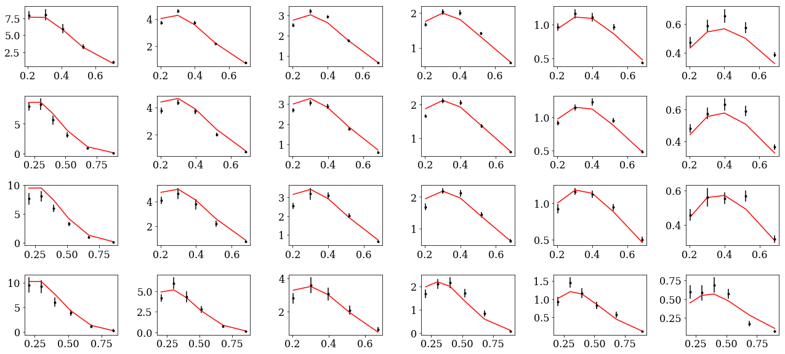

For further examples of plotting for different experimental kinematics, see the workbook for MC sampling below. We note that the uncertainties inferred from a single fit is not supported in JAM3D
(i.e. Hessian error propagation). Instead, the uncertainties will be inferred by performing a likelihood analysis using MC sampling.

MC sampling
===========

Samples generation
::::::::::::::::::

The MC sampling is performed via a technique known as Nested Sampling (NS).
The setups for NS are in code-block of  :code:`input.py`

.. code-block:: python

  conf['nruns']=1
  conf['factor']=4.0
  conf['kappa']=1.5
  conf['tol']=1e-10
  conf['itmax']=int(1e7)
  conf['block size']=10
  conf['nll shift']=0

:code:`conf['factor']`  and :code:`conf['kappa']`  are the most relevant parameters in NS.
:code:`conf['factor']` controls the number of active points in NS:

.. math::
  {\rm active~points} = {\rm factor} \times {\rm number~of~parameters}

The sampling is more dense with increasing values of :code:`factor`

With the MC setup, the sampling can be started using ::

  jam3d -t 3 input.py

optionally one can add the flag :code:`-p` to parallelize the likelihood evaluation.

Analysis
::::::::

The example00 comes with a jupyter notebook  to guide the analysis. The relevant
code lines are shown below.

.. code:: python

    import sys,os
    from fitlab.resman import RESMAN
    from fitlab.mcsamp import MCSAMP
    from tools.config import load_config,conf
    from tools.tools import load, save,checkdir
    from tools.mcstat import chi2hist, parhist
    from tools.mcproc import impose_cdf_cut
    import pylab as py
    import numpy as np
    import pandas as pd
    import copy
    def lprint(msg):
        sys.stdout.write('\r')
        sys.stdout.write('%s' %msg)
        sys.stdout.flush()
    %matplotlib inline

.. code:: python

    runs=load('./summary.mcp')
    load_config('./input.py')
    checkdir('results')

.. code:: python

    conf['resman'] = RESMAN(mode='solo',ip=None,nworkers=5)
    res=conf['resman'].get_residuals(conf['parman'].par)
    npts=len(res[0])
    print '\nnumber of data points = ',npts

.. parsed-literal::

    loading sidis data sets 1007
    number of data points =  978

Chi2 profile for each run
:::::::::::::::::::::::::

.. code:: python

    nrows,ncols=1,1
    fig = py.figure(figsize=(ncols*5,nrows*3))

    ax=py.subplot(nrows,ncols,1)
    R=(0,600)
    for k in runs:
        if k=='all': continue
        ax.hist(2*runs[k]['nll']-npts,bins=50,range=R,histtype='step',label=str(k))
    ax.legend()
    ax.set_xlabel('chi2-npts')
    py.tight_layout()

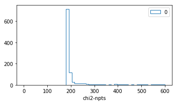

distribution of parameters
::::::::::::::::::::::::::

.. code:: python

    class parhist:

        def __init__(self,runs,inputmod=None):

            self.inputmod=inputmod
            self.order=self.get_ordered_free_params()
            self.tabs,self.tabs_a=self.get_tabs(runs)

            self.kind1=[]
            self.kind2=[]

            for _ in conf['params']:   self.kind1.append(_)
            for _ in conf['datasets']: self.kind2.append(_)

        def get_ordered_free_params(self):
            order=[]

            for k in conf['params']:
                for kk in conf['params'][k]:
                    if conf['params'][k][kk]['fixed']==False:
                        order.append([1,k,kk])

            if 'datasets' in conf:
                for k in conf['datasets']:
                    for kk in conf['datasets'][k]['norm']:
                        if conf['datasets'][k]['norm'][kk]['fixed']==False:
                          order.append([2,k,kk])

            return order

        def get_tabs(self,runs):
            """
            create pandas data frame for the samples
            """
            tabs={}
            tabs_a={}
            for k in runs:
                tab,tab_a={},{}
                tab['nll']=runs[k]['nll']
                tab['weights']=runs[k]['weights']
                samples=np.transpose(runs[k]['samples'])
                active_p=np.transpose(runs[k]['active p'])
                for i in range(len(self.order)):
                    _,kind,par=self.order[i]
                    tab['%s:%s'%(kind,str(par))]=samples[i]
                    tab_a['%s:%s'%(kind,str(par))]=active_p[i]
                tabs[k]=pd.DataFrame(tab)
                tabs_a[k]=pd.DataFrame(tab_a)
            return tabs,tabs_a

        def plot(self,tabs,tabs_a,entries,kind1,kind2,iRange=0):

            for i in range(len(entries)):
                self.cnt+=1
                if entries[i]==None: continue
                ax=py.subplot(self.nrows,self.ncols,self.cnt)
                kind,par=entries[i].split(':')
                for _ in kind1:
                    if kind==_:
                        vmin=conf['params'][_][par]['min']
                        vmax=conf['params'][_][par]['max']
                        R=(vmin,vmax)
                        E0=conf['params'][_][par]['value']
                for _ in kind2:
                    if kind==_:
                        vmin=conf['datasets'][_]['norm'][int(par)]['min']
                        vmax=conf['datasets'][_]['norm'][int(par)]['max']
                        R=(vmin,vmax)
                        E0=conf['datasets'][_]['norm'][int(par)]['value']
                if iRange==0:pass
                else: R=None

                for _ in tabs:
                    if _=='all': continue
                    tab=tabs[_]
                    ax.hist(tab[entries[i]],range=R,bins=50,weights=tab['weights'],\
                            histtype='step',label=str(_))

                ax.hist(tabs['all'][entries[i]],range=R,bins=50,\
                        edgecolor='k',hatch='...',\
                        weights=tabs['all']['weights'],histtype='step',label='all')

                ax.axvline(E0)
                #ax.plot(tabs_a['all'][entries[i]],np.zeros(tabs_a['all'][entries[i]].size),'ro')
                ax.set_title('%s:%s'%(kind,par))

        def hist_widths(self):

            entries=[]
            for kind in self.kind1:
                for par in conf['params'][kind]:
                    for _ in ['widths1','widths2']:
                        if _ in par and conf['params'][kind][par]['fixed']==False:
                            entries.append('%s:%s'%(kind,par))

            if len(entries)==0: return
            self.ncols=3
            self.nrows=len(entries)/self.ncols
            if len(entries)%self.ncols!=0: self.nrows+=1
            fig = py.figure(figsize=(self.ncols*5,self.nrows*3))
            self.cnt=0
            self.plot(self.tabs,self.tabs_a,entries,self.kind1,self.kind2,iRange=0)
            py.tight_layout()

    ph=parhist(runs)
    ph.hist_widths()

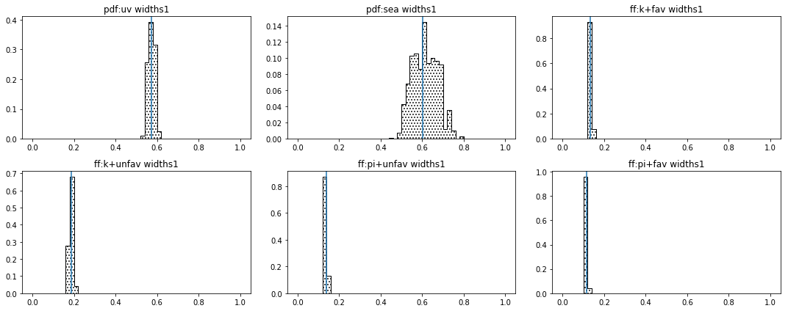

purge the samples
:::::::::::::::::

.. code:: python

    cdfcut=0.001
    weights=np.sort(runs['all']['weights'])
    cdf0=[]
    for i in range(weights.size):
        cdf0.append(np.sum(weights[:i+1]))
    cdf=[cdf0[i]  for i in range(weights.size)  if cdf0[i]>cdfcut]
    idx=[i  for i in range(weights.size)  if cdf0[i]>cdfcut]

    print 'initial size=',len(weights)
    weights,samples= impose_cdf_cut(runs['all'],cdfcut)
    print 'final   size=',len(weights)

    nrows,ncols=1,1
    fig = py.figure(figsize=(ncols*5,nrows*3))

    ax=py.subplot(nrows,ncols,1)
    ax.plot(range(len(cdf0)),cdf0)
    ax.plot(idx,cdf)

    ax.set_ylabel('CDF')
    ax.set_xlabel('number of samples')
    py.tight_layout()

.. parsed-literal::

    initial size= 1056
    final   size= 218

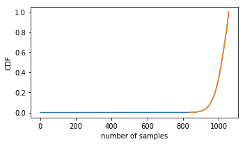

compute theory
::::::::::::::

.. code:: python

    data={'weights':weights}
    cnt=0
    for s in samples:
        cnt+=1
        lprint('%d/%d'%(cnt,len(samples)))
        conf['resman'].get_residuals(s);
        for k in conf['resman'].sidisres.tabs:
            if k  not in data: data[k]=[]
            thy=conf['resman'].sidisres.tabs[k]['thy']
            norm=conf['datasets']['sidis']['norm'][k]['value']
            shift=conf['resman'].sidisres.tabs[k]['shift']
            data[k].append(shift+thy/norm)
    save(data,'results/%s'%('sidis.dat'))

.. parsed-literal::

    218/218

compute averages
::::::::::::::::

.. code:: python

    data=load('results/%s'%('sidis.dat'))
    for k in data: data[k]=np.array(data[k])
    thy,dthy={},{}
    for k in data:
        if k=='weights': continue
        thy[k]=np.einsum('i,ik->k',data['weights'],data[k])
        dthy[k]=np.einsum('i,ik->k',data['weights'],(data[k]-thy[k])**2)**0.5
    for k in thy:
        conf['resman'].sidisres.tabs[k]['thy']=copy.copy(thy[k])
        conf['resman'].sidisres.tabs[k]['dthy']=copy.copy(dthy[k])

.. code:: python

    report=conf['resman'].gen_report(verb=0,level=1)
    delimiters=[]
    for i in range(len(report)):
        if 'reaction:' in report[i]: delimiters.append(i)

    data={}
    nlines=len(report)
    for i in range(len(delimiters)):
        ini=delimiters[i]
        if i==len(delimiters)-1: fin=len(report)
        else: fin=delimiters[i+1]
        reaction=report[ini].replace('reaction:','').strip()
        data[reaction]={'raw data':report[ini:fin]}

    for k in data:
        print k
        block=data[k]['raw data']
        isep=[i for i in range(len(block)) if '--------' in block[i]][0]
        data[k]['summary']=[block[i] for i in range(isep)]
        data[k]['tables']=[block[i] for i in range(isep+1,len(block))]

        tabs={}
        for l in data[k]['tables']:
            info=l.split(',')
            col=[s for s in info if 'col' in s][0].split('=')[1].strip()
            if col not in tabs: tabs[col]={}
            info=[[ss.strip() for ss in s.split('=')] for s in info if 'col' not in info  if s.strip()!='']

            for s in info:
                if s[0] not in tabs[col]: tabs[col][s[0]]=[]

            for s in info:
                try:
                    value=float(s[1])
                except:
                    value=s[1]
                tabs[col][s[0]].append(value)

        data[k]['tabs']=tabs
    save(data,'results/data_and_thy.dat')

.. parsed-literal::

    sidis

.. code:: python

    def summary():
        for k in data:
            print ""
            for l in data[k]['summary']: print l
    summary()

.. parsed-literal::

    reaction: sidis
        idx        tar        had        col        obs  npts       chi2      rchi2      nchi2
       1000     proton        pi+     hermes   M_Hermes   127     322.28       0.00       0.00
       1001     proton        pi-     hermes   M_Hermes   124     168.29       0.00       0.00
       1002     proton         k+     hermes   M_Hermes   122      72.20       0.00       0.00
       1003     proton         k-     hermes   M_Hermes   115      42.68       0.00       0.00
       1004   deuteron        pi+     hermes   M_Hermes   124     159.89       0.00       0.00
       1005   deuteron        pi-     hermes   M_Hermes   122     157.78       0.00       0.00
       1006   deuteron         k+     hermes   M_Hermes   122      76.20       0.00       0.00
       1007   deuteron         k-     hermes   M_Hermes   122     169.94       0.00       0.00

plot data and theory
::::::::::::::::::::

.. code:: python

    data=load('results/data_and_thy.dat')

1000: tar=p had=pi+

.. code:: python

    tab=pd.DataFrame(data['sidis']['tabs']['hermes']).query('idx==1000')
    tab['xr']=[np.round(x,2) for x in tab.x]
    ZR=[[0.1,0.2],[0.2,0.25],[0.25,0.3],[0.3,0.4],[0.4,0.5],[0.5,1]]

    nrows,ncols=1,2
    fig = py.figure(figsize=(ncols*3,nrows*3))
    ax=py.subplot(nrows,ncols,1)
    ax.plot(tab['x'],tab['Q2'],'.'); ax.set_xlabel(r'$x$',size=20); ax.set_ylabel(r'$Q^2$',size=20)
    ax=py.subplot(nrows,ncols,2)
    ax.plot(tab['pT'],tab['z'],'.'); ax.set_xlabel(r'$p_T$',size=20); ax.set_ylabel(r'$z$',size=20);
    for zr in ZR: ax.axhline(y=zr[0]);
    py.tight_layout()

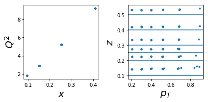

.. code:: python

    nrows,ncols=6,6
    fig = py.figure(figsize=(ncols*3,nrows*2))
    cnt=0
    for xr in np.unique(tab['xr']):
        tabx=tab.query('xr==%f'%xr)
        for zr in ZR:
            tabz=tabx.query('z>%f and z<%f'%(zr[0],zr[1]))
            cnt+=1
            ax=py.subplot(nrows,ncols,cnt)
            ax.errorbar(tabz['pT'],tabz['exp'],yerr=tabz['alpha'],fmt='k.')
            ax.fill_between(tabz['pT'],tabz['thy']-tabz['dthy'],tabz['thy']+tabz['dthy'])

    py.tight_layout()

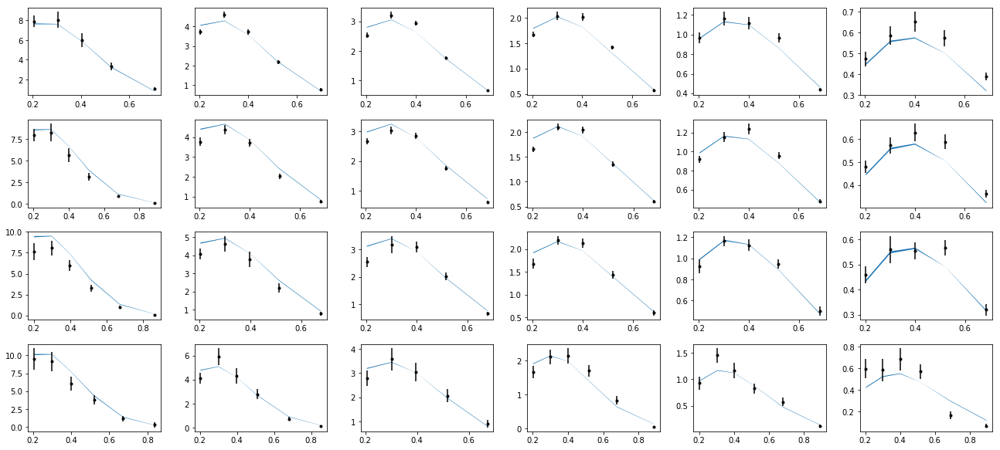

1001 tar=p had=pi-

.. code:: python

    tab=pd.DataFrame(data['sidis']['tabs']['hermes']).query('idx==1001')
    tab['xr']=[np.round(x,2) for x in tab.x]
    ZR=[[0.1,0.2],[0.2,0.25],[0.25,0.3],[0.3,0.4],[0.4,0.5],[0.5,1]]

    nrows,ncols=1,2
    fig = py.figure(figsize=(ncols*3,nrows*3))
    ax=py.subplot(nrows,ncols,1)
    ax.plot(tab['x'],tab['Q2'],'.'); ax.set_xlabel(r'$x$',size=20); ax.set_ylabel(r'$Q^2$',size=20)
    ax=py.subplot(nrows,ncols,2)
    ax.plot(tab['pT'],tab['z'],'.'); ax.set_xlabel(r'$p_T$',size=20); ax.set_ylabel(r'$z$',size=20);
    for zr in ZR: ax.axhline(y=zr[0]);
    py.tight_layout()

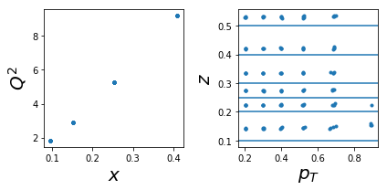

.. code:: python

    nrows,ncols=6,6
    fig = py.figure(figsize=(ncols*3,nrows*2))
    cnt=0
    for xr in np.unique(tab['xr']):
        tabx=tab.query('xr==%f'%xr)
        for zr in ZR:
            tabz=tabx.query('z>%f and z<%f'%(zr[0],zr[1]))
            cnt+=1
            ax=py.subplot(nrows,ncols,cnt)
            ax.errorbar(tabz['pT'],tabz['exp'],yerr=tabz['alpha'],fmt='k.')
            ax.fill_between(tabz['pT'],tabz['thy']-tabz['dthy'],tabz['thy']+tabz['dthy'])

    py.tight_layout()

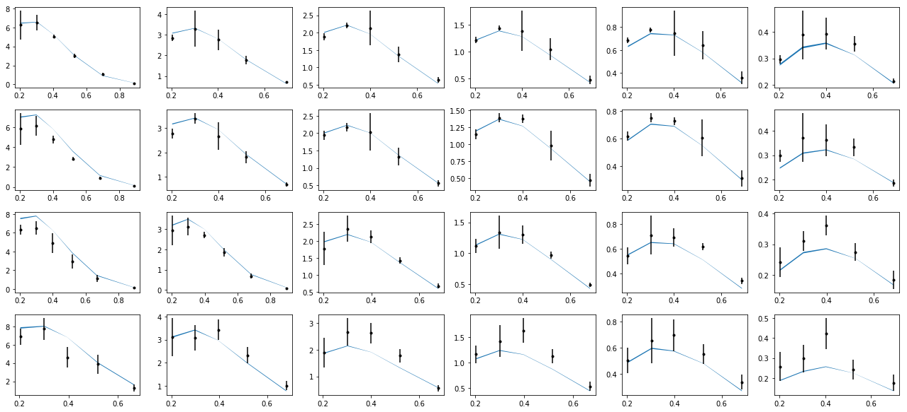

1004: tar=d had=pi+

.. code:: python

    tab=pd.DataFrame(data['sidis']['tabs']['hermes']).query('idx==1004')
    tab['xr']=[np.round(x,2) for x in tab.x]
    ZR=[[0.1,0.2],[0.2,0.25],[0.25,0.3],[0.3,0.4],[0.4,0.5],[0.5,1]]

    nrows,ncols=1,2
    fig = py.figure(figsize=(ncols*3,nrows*3))
    ax=py.subplot(nrows,ncols,1)
    ax.plot(tab['x'],tab['Q2'],'.'); ax.set_xlabel(r'$x$',size=20); ax.set_ylabel(r'$Q^2$',size=20)
    ax=py.subplot(nrows,ncols,2)
    ax.plot(tab['pT'],tab['z'],'.'); ax.set_xlabel(r'$p_T$',size=20); ax.set_ylabel(r'$z$',size=20);
    for zr in ZR: ax.axhline(y=zr[0]);
    py.tight_layout()

.. code:: python

    nrows,ncols=6,6
    fig = py.figure(figsize=(ncols*3,nrows*2))
    cnt=0
    for xr in np.unique(tab['xr']):
        tabx=tab.query('xr==%f'%xr)
        for zr in ZR:
            tabz=tabx.query('z>%f and z<%f'%(zr[0],zr[1]))
            cnt+=1
            ax=py.subplot(nrows,ncols,cnt)
            ax.errorbar(tabz['pT'],tabz['exp'],yerr=tabz['alpha'],fmt='k.')
            ax.fill_between(tabz['pT'],tabz['thy']-tabz['dthy'],tabz['thy']+tabz['dthy'])

    py.tight_layout()

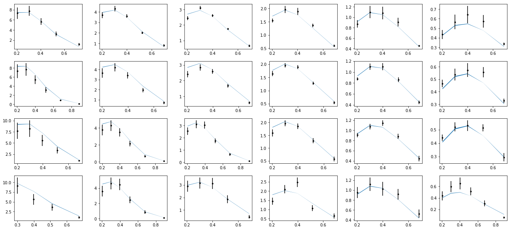

1005: tar=d had=pi-

.. code:: python

    tab=pd.DataFrame(data['sidis']['tabs']['hermes']).query('idx==1005')
    tab['xr']=[np.round(x,2) for x in tab.x]
    ZR=[[0.1,0.2],[0.2,0.25],[0.25,0.3],[0.3,0.4],[0.4,0.5],[0.5,1]]

    nrows,ncols=1,2
    fig = py.figure(figsize=(ncols*3,nrows*3))
    ax=py.subplot(nrows,ncols,1)
    ax.plot(tab['x'],tab['Q2'],'.'); ax.set_xlabel(r'$x$',size=20); ax.set_ylabel(r'$Q^2$',size=20)
    ax=py.subplot(nrows,ncols,2)
    ax.plot(tab['pT'],tab['z'],'.'); ax.set_xlabel(r'$p_T$',size=20); ax.set_ylabel(r'$z$',size=20);
    for zr in ZR: ax.axhline(y=zr[0]);
    py.tight_layout()

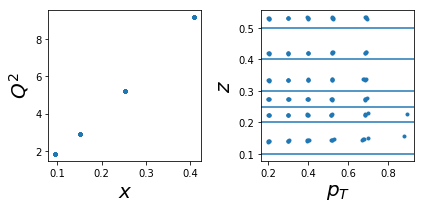

.. code:: python

    nrows,ncols=6,6
    fig = py.figure(figsize=(ncols*3,nrows*2))
    cnt=0
    for xr in np.unique(tab['xr']):
        tabx=tab.query('xr==%f'%xr)
        for zr in ZR:
            tabz=tabx.query('z>%f and z<%f'%(zr[0],zr[1]))
            cnt+=1
            ax=py.subplot(nrows,ncols,cnt)
            ax.errorbar(tabz['pT'],tabz['exp'],yerr=tabz['alpha'],fmt='k.')
            ax.fill_between(tabz['pT'],tabz['thy']-tabz['dthy'],tabz['thy']+tabz['dthy'])

    py.tight_layout()

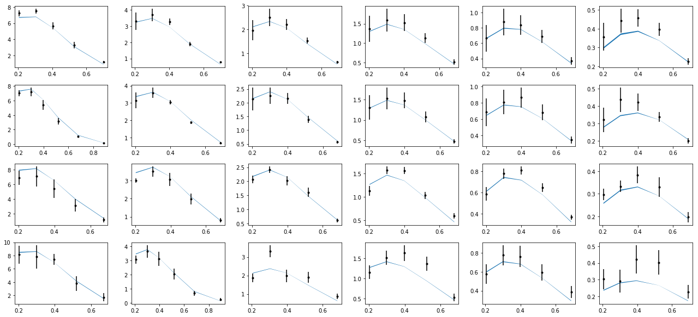

1002: tar=p had=K+

.. code:: python

    tab=pd.DataFrame(data['sidis']['tabs']['hermes']).query('idx==1002')
    tab['xr']=[np.round(x,2) for x in tab.x]
    ZR=[[0.1,0.2],[0.2,0.25],[0.25,0.3],[0.3,0.4],[0.4,0.5],[0.5,1]]

    nrows,ncols=1,2
    fig = py.figure(figsize=(ncols*3,nrows*3))
    ax=py.subplot(nrows,ncols,1)
    ax.plot(tab['x'],tab['Q2'],'.'); ax.set_xlabel(r'$x$',size=20); ax.set_ylabel(r'$Q^2$',size=20)
    ax=py.subplot(nrows,ncols,2)
    ax.plot(tab['pT'],tab['z'],'.'); ax.set_xlabel(r'$p_T$',size=20); ax.set_ylabel(r'$z$',size=20);
    for zr in ZR: ax.axhline(y=zr[0]);
    py.tight_layout()

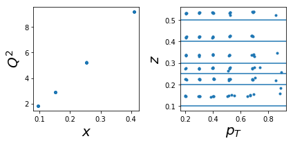

.. code:: python

    nrows,ncols=6,6
    fig = py.figure(figsize=(ncols*3,nrows*2))
    cnt=0
    for xr in np.unique(tab['xr']):
        tabx=tab.query('xr==%f'%xr)
        for zr in ZR:
            tabz=tabx.query('z>%f and z<%f'%(zr[0],zr[1]))
            cnt+=1
            ax=py.subplot(nrows,ncols,cnt)
            ax.errorbar(tabz['pT'],tabz['exp'],yerr=tabz['alpha'],fmt='k.')
            ax.fill_between(tabz['pT'],tabz['thy']-tabz['dthy'],tabz['thy']+tabz['dthy'])

    py.tight_layout()

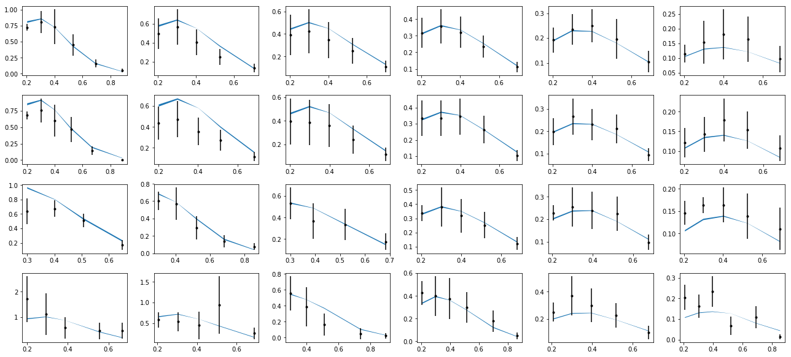

1003: tar=p had=K-

.. code:: python

    tab=pd.DataFrame(data['sidis']['tabs']['hermes']).query('idx==1003')
    tab['xr']=[np.round(x,2) for x in tab.x]
    ZR=[[0.1,0.2],[0.2,0.25],[0.25,0.3],[0.3,0.4],[0.4,0.5],[0.5,1]]

    nrows,ncols=1,2
    fig = py.figure(figsize=(ncols*3,nrows*3))
    ax=py.subplot(nrows,ncols,1)
    ax.plot(tab['x'],tab['Q2'],'.'); ax.set_xlabel(r'$x$',size=20); ax.set_ylabel(r'$Q^2$',size=20)
    ax=py.subplot(nrows,ncols,2)
    ax.plot(tab['pT'],tab['z'],'.'); ax.set_xlabel(r'$p_T$',size=20); ax.set_ylabel(r'$z$',size=20);
    for zr in ZR: ax.axhline(y=zr[0]);
    py.tight_layout()

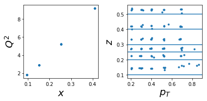

.. code:: python

    nrows,ncols=6,6
    fig = py.figure(figsize=(ncols*3,nrows*2))
    cnt=0
    for xr in np.unique(tab['xr']):
        tabx=tab.query('xr==%f'%xr)
        for zr in ZR:
            tabz=tabx.query('z>%f and z<%f'%(zr[0],zr[1]))
            cnt+=1
            ax=py.subplot(nrows,ncols,cnt)
            ax.errorbar(tabz['pT'],tabz['exp'],yerr=tabz['alpha'],fmt='k.')
            ax.fill_between(tabz['pT'],tabz['thy']-tabz['dthy'],tabz['thy']+tabz['dthy'])

    py.tight_layout()

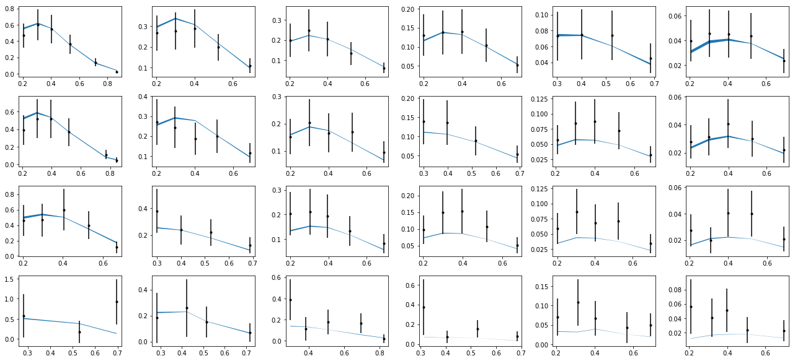

1006: tar=d had=K+

.. code:: python

    tab=pd.DataFrame(data['sidis']['tabs']['hermes']).query('idx==1006')
    tab['xr']=[np.round(x,2) for x in tab.x]
    ZR=[[0.1,0.2],[0.2,0.25],[0.25,0.3],[0.3,0.4],[0.4,0.5],[0.5,1]]

    nrows,ncols=1,2
    fig = py.figure(figsize=(ncols*3,nrows*3))
    ax=py.subplot(nrows,ncols,1)
    ax.plot(tab['x'],tab['Q2'],'.'); ax.set_xlabel(r'$x$',size=20); ax.set_ylabel(r'$Q^2$',size=20)
    ax=py.subplot(nrows,ncols,2)
    ax.plot(tab['pT'],tab['z'],'.'); ax.set_xlabel(r'$p_T$',size=20); ax.set_ylabel(r'$z$',size=20);
    for zr in ZR: ax.axhline(y=zr[0]);
    py.tight_layout()

.. code:: python

    nrows,ncols=6,6
    fig = py.figure(figsize=(ncols*3,nrows*2))
    cnt=0
    for xr in np.unique(tab['xr']):
        tabx=tab.query('xr==%f'%xr)
        for zr in ZR:
            tabz=tabx.query('z>%f and z<%f'%(zr[0],zr[1]))
            cnt+=1
            ax=py.subplot(nrows,ncols,cnt)
            ax.errorbar(tabz['pT'],tabz['exp'],yerr=tabz['alpha'],fmt='k.')
            ax.fill_between(tabz['pT'],tabz['thy']-tabz['dthy'],tabz['thy']+tabz['dthy'])

    py.tight_layout()

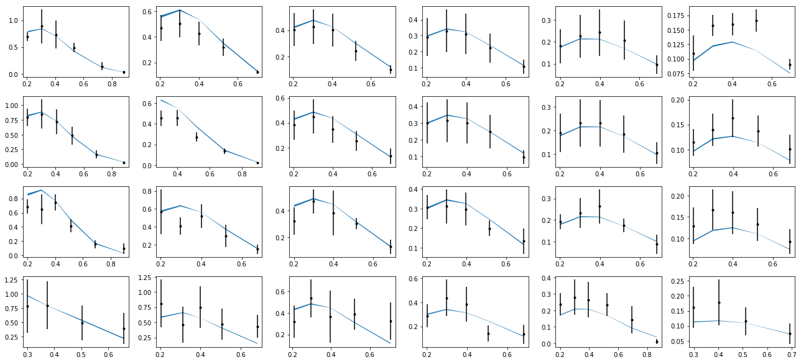

1007: tar=d had=K-

.. code:: python

    tab=pd.DataFrame(data['sidis']['tabs']['hermes']).query('idx==1007')
    tab['xr']=[np.round(x,2) for x in tab.x]
    ZR=[[0.1,0.2],[0.2,0.25],[0.25,0.3],[0.3,0.4],[0.4,0.5],[0.5,1]]

    nrows,ncols=1,2
    fig = py.figure(figsize=(ncols*3,nrows*3))
    ax=py.subplot(nrows,ncols,1)
    ax.plot(tab['x'],tab['Q2'],'.'); ax.set_xlabel(r'$x$',size=20); ax.set_ylabel(r'$Q^2$',size=20)
    ax=py.subplot(nrows,ncols,2)
    ax.plot(tab['pT'],tab['z'],'.'); ax.set_xlabel(r'$p_T$',size=20); ax.set_ylabel(r'$z$',size=20);
    for zr in ZR: ax.axhline(y=zr[0]);
    py.tight_layout()

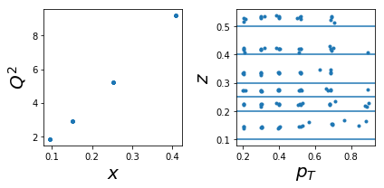

.. code:: python

    nrows,ncols=6,6
    fig = py.figure(figsize=(ncols*3,nrows*2))
    cnt=0
    for xr in np.unique(tab['xr']):
        tabx=tab.query('xr==%f'%xr)
        for zr in ZR:
            tabz=tabx.query('z>%f and z<%f'%(zr[0],zr[1]))
            cnt+=1
            ax=py.subplot(nrows,ncols,cnt)
            ax.errorbar(tabz['pT'],tabz['exp'],yerr=tabz['alpha'],fmt='k.')
            ax.fill_between(tabz['pT'],tabz['thy']-tabz['dthy'],tabz['thy']+tabz['dthy'])

    py.tight_layout()

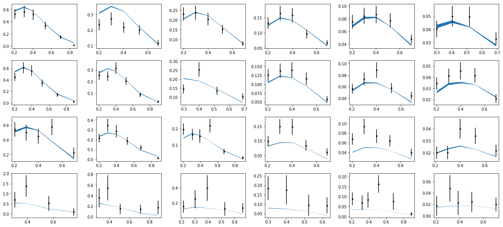
